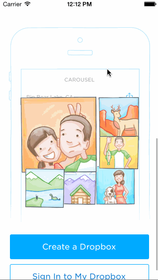

CodePath_Carousel
=============

This is a carousel iOS app for the sign in flow.

### Hours to Complete
About 10 hours.

### Completed Stories
 * [x] REQUIRED: Static photo tiles on the initial screen
   * [x] OPTIONAL: Photo tiles move with scrolling
 * [x] Sign In
   * [x] REQUIRED: Tapping on email/password reveals the keyboard and shifts the scrollview and Sign In button up.
   * [x] REQUIRED: User sees an error alert when no email is present or no password is present.
   * [x] REQUIRED: User sees a loading screen upon tapping the Sign In button.
   * [x] REQUIRED: User sees an error alert when entering the wrong email/password combination.
   * [x] REQUIRED: User is taken to the tutorial screens upon entering the correct email/password combination.
   * [x] OPTIONAL: When the keyboard is visible, if the user pulls down(I did it with tapping) on the scrollview, it will dismiss the keyboard.
 * [x] Tutorial Screens
   * [x] REQUIRED: User can page between the screens
   * [x] OPTIONAL: User can page between the screens with updated dots
   * [x] OPTIONAL: Upon reaching the 4th page, hide the dots and show the "Take Carousel for a Spin" button.
 * [x] Image Timeline
   * [x] REQUIRED: Display a scrollable view of images.
   * [x] REQUIRED: User can tap on the conversations button to see the conversations screen (push).
   * [x] REQUIRED: User can tap on the profile image to see the settings view (modal from below).
 * [x] Settings
   * [x] REQUIRED: User can dismiss the settings screen.
   * [x] REQUIRED: User can log out

### Other Notes
 * N/A

### Walkthrough

